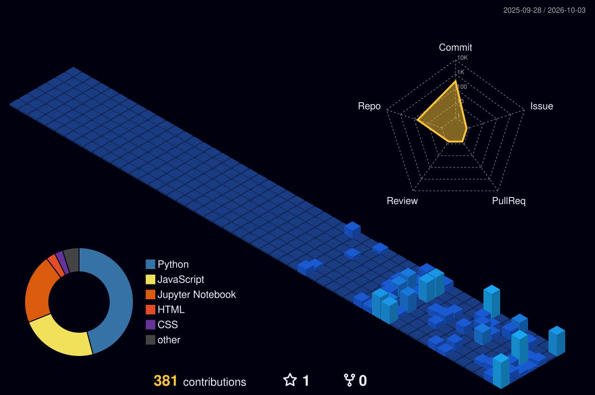

<div align="center">

<!-- 🚀 HERO -->


<br/><br/>

<!-- 🤖 WHAT I BUILD • 🌱 WHAT I'M EXPLORING -->


<br/><br/>

<!-- ⚙️ TECH STACK -->


<br/><br/>

<!-- 🪪 DEVELOPER ID + DASHBOARD -->


<br/><br/>

</div>


## 🚀 Featured Builds

| Project | What it is | Stack |
|:---|:---|:---:|
| [**FraudX — Agentic Fraud Investigation**](https://github.com/rohanbhowm25308/FraudX) | Agentic fraud investigation system using graph-based intelligence and TigerGraph | `Python` `AI` `TigerGraph` |
| [**Orchestrator AI**](https://github.com/rohanbhowm25308) | Intelligent decision-making system designed to orchestrate AI-powered workflows | `Python` `Flask` `AI` |
| [**Nova AI Career Recommendation Engine**](https://github.com/rohanbhowm25308) | AI-powered career recommendation platform connecting skills, interests and career paths | `Python` `GenAI` `Flask` |
| [**ProjectDNA AI Recommender**](https://github.com/rohanbhowm25308) | AI-powered project recommendation system using intelligent tagging and GenAI | `Python` `GenAI` `RAG` |
| [**Sentiment Analysis Dashboard**](https://github.com/rohanbhowm25308) | NLP dashboard for analysing text sentiment using machine learning | `Python` `Flask` `NLP` |
| [**Customer Segmentation**](https://github.com/rohanbhowm25308) | Customer segmentation using K-Means clustering and interactive analytics | `Python` `ML` `Streamlit` |

<br/>

## 📊 Data Science Projects

| Project | Focus | Technologies |
|:---|:---|:---:|
| [**ChurnScope — Customer Churn Analytics**](https://github.com/rohanbhowm25308/ChurnScope-Customer-Churn-Analytics) | Customer churn analysis and machine learning | `Python` `Pandas` `Scikit-learn` |
| [**Student Performance Statistical Analysis**](https://github.com/rohanbhowm25308/Student-Performance-Statistical-Analysis) | Statistical analysis and visualization of student performance | `Python` `Pandas` `Matplotlib` |
| **Air Quality Analysis** | Data cleaning, exploration and visualization of air-quality data | `Python` `Pandas` `Visualization` |

<br/>


<div align="center">

## 🌃 My Contribution City

*Every commit builds another part of the journey — rebuilt automatically every day.*



<br/><br/>

</div>


## 🧠 What I'm Currently Exploring

```text
Artificial Intelligence     ████████████████████
Machine Learning             ████████████████████
Data Science                 ████████████████████
Generative AI                ███████████████████░
AI Agents                    ██████████████████░░
RAG Systems                  █████████████████░░░
Python Backend               ███████████████████░
Data Analytics               ████████████████████
